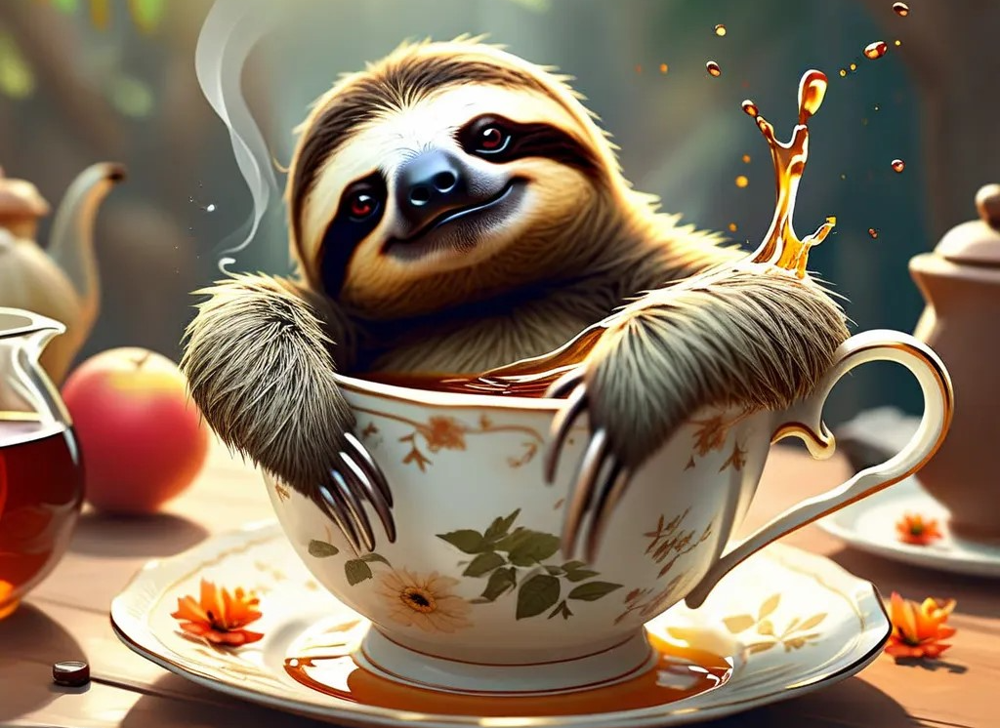

<h1 align="center">
  
</h1>
<h4 align="center">
  
  
  
  
</h4>

  
<a href="https://hatman-aws-nova-canvas.hf.space"> AWS Nova Canvas » </a> </b> 

# AWS Nova Canvas Image Generation

A Gradio application for advanced image generation using Amazon Nova Canvas, offering comprehensive image manipulation capabilities.

## Capabilities

- **Text to Image**: Generate images from text prompts
- **Inpainting**: Modify specific image areas 
- **Outpainting**: Extend image boundaries 
- **Image Variation**: Create image variations
- **Image Conditioning**: Generate images based on input image and text
- **Color Guided Content**: Create images using reference color palettes
- **Background Removal**: Remove image backgrounds

## Prerequisites

- AWS credentials configured (AmazonBedrockFullAccess)
- Boto3 Python library
- Gradio 5.6.0

## Technical Details

- Model: Amazon Nova Canvas (amazon.nova-canvas-v1:0)
- Model: Amazon Nova Lite (us.amazon.nova-lite-v1:0)
- Image Generation Parameters:
  - Default resolution: 1024x1024
  - Quality: Standard
  - CFG Scale: 8.0
  - Configurable seed

## Documentation

For detailed usage, visit [AWS Nova documentation](https://docs.aws.amazon.com/nova/latest/userguide/what-is-nova.html).
